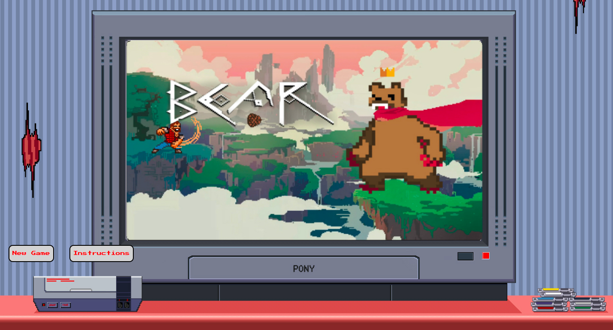
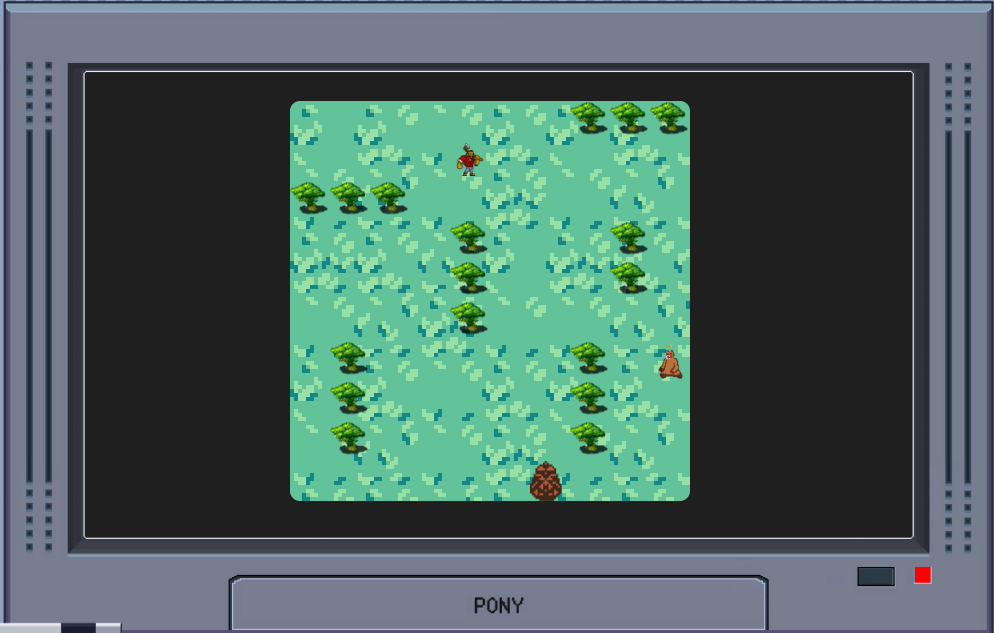

# WDI-34 Project 1: 'King Ironpaw: A Pinecone Too Many'

This week marked our first individual project, 3 weeks into WDI. We were given a specification to build an in-browser game with the following technical requirements.

Your app must:

1. Render a game in the browser
2. Switch turns between two players
3. Design logic for winning & visually display which player won
4. Include separate HTML / CSS / JavaScript files
5. Stick with KISS (Keep It Simple Stupid) and DRY (Don't Repeat Yourself) principles
6. Use Javascript or jQuery for DOM manipulation
7. Deploy your game online, where the rest of the world can access it
8. Use semantic markup for HTML and CSS (adhere to best practices)

## The Game

'King Ironpaw: A Pinecone Too Many' is a grid-based game in which the user plays a lumberjack stranded in the forest. Trying to survive the night and staving off angry royal bears with nought but pinecones. The pinecones are randomly generated and can only be thrown from 2 squares away or less to make an impact on the bear.

## Planning & Concept:
To begin the thought process, I drew up columns detailing, themes, genres and a twist. Should I be happy with the game by the third column I would devise a way in which it could meet the 2-player criteria.

I opted for a grid based game featuring a bear. I proceeded to draw out a hundred-square on the whiteboard to help write down the squares in which I wanted my characters and my trees.
As collision detection was not going to be as difficult I decided to add elements to my game which would add to the complexity in writing it. This would later end being the reason for my inability to achieve minimum viable product.

## Difficulties:
My efficiency and productivity at the beginning of the project was at its highest as I had diligently planned each step out carefully but as I came across more unexpected problems my progress slowed and I strayed away from using trello.

My biggest difficulty was getting the lumberjack to throw a pinecone in a particular direction. At first I considered having the WASD keys in conjunction with the spacebar without the character also moving before firing. This was then abruptly changed as key jamming did not allow it to be easily done. I changed the elements of the game to include IJKL to fire in each direction. However as it was getting closer to the end of the project getting the future pinecone to traverse the grid and interact with the bear and complete refactoring and styling was going to be difficult.

## Accomplishments:
I feel that the biggest accomplishment is that indeed it looks very aesthetically pleasing and is consistent with the theme of an 8-bit pixel game throughout. Getting the animation to run smoothly

## Features:

I had in mind a lot of features that I did not get to deploy, such as a library of trees which would then randomly generate trees each time you played.

In addition, I wanted to allow there to be an option for a second player to play as the bear and have a lumberjack and bear selection where the user can choose which sprite they use.

Having a responsive game would also be very achievable and is something I look forward to implementing in future.

Refactoring! is something I definitely need to implement more

## Review:

Now that I have finished my first project week, I feel that I have bolstered my knowledge in javascript and CSS. I will need to ensure that I tackle the problem head-on before moving onto another feature.

Please bear with me on my learning journey.
# ʕ´•㉨•`ʔ -Linda Lê
